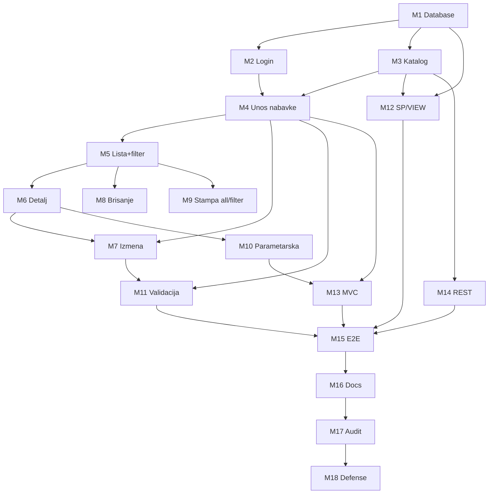

# IMPLEMENTATION_PLAN — Milestone plan (faza 2+)

**Projekat:** Nabavka društvenih igara  
**Referenca:** [PROJECT_SPEC.md](PROJECT_SPEC.md), [REQUIREMENTS.md](REQUIREMENTS.md), [ADAPTATION_PLAN.md](ADAPTATION_PLAN.md)  
**Napomena:** Ova faza (planning) je završena. Implementacija aplikacije počinje **tek** nakon eksplicitnog odobrenja milestone-a.

---

## Principi

1. Pisani kriterijum > šablon.
2. Minimalan churn; maksimalna reuse šablona.
3. CRUD kataloga ≠ CRUD glavnog dokumenta.
4. Bez novih poslovnih pravila (duplikat igre, gornji limiti, zatvoreni dobavljači).

---

## Milestone 1 — Database / domain adaptation

| Stavka | Sadržaj |
|--------|---------|
| **Requirement IDs** | DB-01–19, TECH-02–06, NF-01, TOP-03–06, DEF-04 |
| **Dependencies** | Nema |
| **Preserve** | `tehnoloskeKlase/*`, `korisnik` tabela, FK cascade pattern |
| **Adapt** | `bazapodataka/BazaPodataka.txt`, `bazapodataka/Pogledi i Stored procedure.txt` |
| **Create if needed** | Migracioni SQL samo ako se ne radi full recreate |
| **Verification** | Import SQL; 4+ tabela; FK celina–deo–šifarnik; UNIQUE BrojNaloga; kolone BrojNaloga, NalogEvidentirao |
| **Regression risks** | Seed podaci; connection XML baza name |

---

## Milestone 2 — Login verification

| Stavka | Sadržaj |
|--------|---------|
| **Requirement IDs** | FUN-01, TECH-04, DB-01, DEF-10 |
| **Dependencies** | M1 |
| **Preserve** | `prijavaprovera.php`, `DBKorisnik.php`, `prijava.php` |
| **Adapt / Fix** | `index.php` (session_destroy), session path u ruteru |
| **Create if needed** | Ne |
| **Verification** | Login → welcome; logout; zaštićene stranice bez sesije |
| **Regression risks** | Session loss na landing |

---

## Milestone 3 — Game lookup adaptation (katalog)

| Stavka | Sadržaj |
|--------|---------|
| **Requirement IDs** | FUN-KAT-01, DB-02/03/19, NF-02/03, OOP-03 |
| **Dependencies** | M1 |
| **Preserve** | CRUD pattern knjiga, upload slike pattern, meni struktura |
| **Adapt** | Entiteti, `DBKnjiga*`, `DBZanr`, `KnjigeController`, `unos.php`, `unosSP.php`, lista, izmena, meni tekstovi |
| **Create if needed** | Samo ako rename zahteva nove fajlove (in-place preferirano) |
| **Verification** | Unos/izmena/brisanje/lista/filter igre; select u nabavci radi |
| **Regression risks** | FK stavke na staru kolonu ISBN |

---

## Milestone 4 — Master-detail procurement creation

| Stavka | Sadržaj |
|--------|---------|
| **Requirement IDs** | FUN-02, FUN-03, TECH-08, TECH-09, OOP-02, DB-09–17, VAL-06–14, DEF-01/06/07/08 |
| **Dependencies** | M1, M2, M3 |
| **Preserve** | `BaznaTransakcija`, MD JS mehanika, kompozicija `NabavkaEntitet` |
| **Adapt** | `NovaNabavka.php`, `nabavkaSnimi.php`, `DBNabavka.php`, `DBStavkaNabavke.php` |
| **Create if needed** | Ne |
| **Verification** | Unos naloga sa ≥1 stavkom u transakciji; BrojNaloga unique; Dobavljac tekst; NalogEvidentirao iz sesije; rollback na grešku |
| **Regression risks** | Stari merge; stara validacija dobavljača |

---

## Milestone 5 — Procurement list + filter

| Stavka | Sadržaj |
|--------|---------|
| **Requirement IDs** | FUN-07, FUN-08, TECH-10, DEF-05 |
| **Dependencies** | M4 |
| **Preserve** | `NabavkeLista.php` layout pattern |
| **Adapt** | `desnoNabavkeLista.php`, `NabavkaModel.php`, `NabavkeController.php`, `Ruter.php` |
| **Create if needed** | Filter UI polja |
| **Verification** | Tabela naloga; filter po BrojNaloga/Datum/Dobavljac; stavke bez pogrešnog GROUP BY |
| **Regression risks** | Pogrešna agregacija stavki |

---

## Milestone 6 — Individual procurement detail

| Stavka | Sadržaj |
|--------|---------|
| **Requirement IDs** | FUN-09, TOP-03–06, DB-16/17 |
| **Dependencies** | M5 |
| **Preserve** | Detail rendering pattern iz liste |
| **Adapt** | Ruta `nabavkaDetalj` ili jasna detail sekcija |
| **Create if needed** | `pogledi/NabavkaDetalj.php`, `delovi/desnoNabavkaDetalj.php` |
| **Verification** | Jedan nalog + sve stavke + rekapitulacija |
| **Regression risks** | Nedostajuća polja mastera |

---

## Milestone 7 — Procurement master-detail edit

| Stavka | Sadržaj |
|--------|---------|
| **Requirement IDs** | FUN-04, FUN-05, TECH-09, VAL-01–14 |
| **Dependencies** | M4, M6 |
| **Preserve** | MD JS iz `NovaNabavka.php` |
| **Adapt** | Extendirati controller/repo |
| **Create if needed** | `nabavkaIzmeni.php`, `NabavkaIzmeniForm.php`, `desnoNabavkaIzmeniForm.php`, rute |
| **Verification** | Izmena mastera; dodavanje/izmena/brisanje stavki u transakciji |
| **Regression risks** | Orphan stavke; unique BrojNaloga pri izmeni |

---

## Milestone 8 — Procurement deletion

| Stavka | Sadržaj |
|--------|---------|
| **Requirement IDs** | FUN-06 |
| **Dependencies** | M5 |
| **Preserve** | CASCADE na stavkama |
| **Adapt** | Meni/lista dugmad |
| **Create if needed** | `nabavkaObrisi.php`, confirm u UI |
| **Verification** | DELETE naloga briše stavke; confirm dialog |
| **Regression risks** | Brisanje pogrešnog ID |

---

## Milestone 9 — Print all / filtered

| Stavka | Sadržaj |
|--------|---------|
| **Requirement IDs** | PRINT-01, PRINT-02 |
| **Dependencies** | M5 |
| **Preserve** | Pattern `KnjigeStampa.php`, `zaglavljestampa.php` |
| **Adapt** | Filter param prosleđen u štampu |
| **Create if needed** | `NabavkeStampa.php`, `desnoStampaNabavke.php`, rute |
| **Verification** | Štampa svih; štampa filtriranih |
| **Regression risks** | Filter nije primenjen na print |

---

## Milestone 10 — Registered-document parametric print

| Stavka | Sadržaj |
|--------|---------|
| **Requirement IDs** | PRINT-03–09, TOP-02–06 |
| **Dependencies** | M6 |
| **Preserve** | Print header/footer delovi |
| **Adapt** | Layout po DOCX prijavi |
| **Create if needed** | `NabavkaParametarskaStampa.php`, `StampaPodatakaONalogu.php`, rute |
| **Verification** | Vizuelno i semantički = prijavljeni nalog (master/detail/rekapitulacija/evidentirao) |
| **Regression risks** | Stara knjiga parametarska ostaje kao katalog demo (ne zamenjuje ovo) |

---

## Milestone 11 — Complete client/server validation

| Stavka | Sadržaj |
|--------|---------|
| **Requirement IDs** | TECH-11, TECH-12, VAL-01–16 |
| **Dependencies** | M4, M7 |
| **Preserve** | Dual client+server pattern |
| **Adapt** | Sve forme nabavke + katalog |
| **Create if needed** | Ne |
| **Verification** | Svaka VAL kategorija: required, tip, dužina, domen, unique; client + server |
| **Regression risks** | Previše restriktivna validacija |

---

## Milestone 12 — Stored procedure and SQL view adaptation/use

| Stavka | Sadržaj |
|--------|---------|
| **Requirement IDs** | TECH-05, TECH-06, TECH-SP-01/02, TECH-VIEW-01/02 |
| **Dependencies** | M1, M3 |
| **Preserve** | `unosSP.php`, `DBKnjigaSP.php`, `DBKnjigaV.php` pattern |
| **Adapt** | SP/VIEW nazivi i kolone na igre |
| **Create if needed** | Ne (bez nabavka-SP/VIEW) |
| **Verification** | Unos igre preko SP; lista/filter preko VIEW |
| **Regression risks** | CALL parameter mismatch |

---

## Milestone 13 — MVC requirement completion/verification

| Stavka | Sadržaj |
|--------|---------|
| **Requirement IDs** | MVC-01, MVC-02, MVC-03 |
| **Dependencies** | M4–M10 |
| **Preserve** | Folderi `kontroler/`, `model/`, `pogledi/` |
| **Adapt** | Nabavka tokovi kroz controller→model→view |
| **Create if needed** | Samo ako nedostaje controller metoda |
| **Verification** | Trace request path; dokumentovati u DOC-14 |
| **Regression risks** | Duplicirani data access (controller vs action) |

---

## Milestone 14 — REST router/service adaptation

| Stavka | Sadržaj |
|--------|---------|
| **Requirement IDs** | REST-01, REST-02, REST-03 |
| **Dependencies** | M3 |
| **Preserve** | `api/router.php` pattern |
| **Adapt** | `knjige`/`knjiga` → `igre`/`igra` |
| **Create if needed** | `api/igre.php`, `api/igra.php` (ili rename) |
| **Verification** | JSON lista i pojedinačna igra preko routera |
| **Regression risks** | Broken old endpoints u README |

---

## Milestone 15 — End-to-end integration verification

| Stavka | Sadržaj |
|--------|---------|
| **Requirement IDs** | FUN-01–10, FUN-KAT-01/02, PRINT-01–09, VAL-01–14 |
| **Dependencies** | M1–M14 |
| **Preserve** | — |
| **Adapt** | Bugfix iz E2E |
| **Create if needed** | Checklist fajl opciono |
| **Verification** | Login → katalog CRUD → unos naloga → lista/filter → detalj → izmena → brisanje → štampa → parametarska |
| **Regression risks** | Katalog vs nabavka mešanje |

---

## Milestone 16 — Documentation

| Stavka | Sadržaj |
|--------|---------|
| **Requirement IDs** | DOC-01–15, NF-06, SUB-01–05 |
| **Dependencies** | M15 (kod stabilan) |
| **Preserve** | — |
| **Adapt** | — |
| **Create if needed** | Seminarska dokumentacija (sve sekcije) |
| **Verification** | Svaka DOC stavka postoji; screenshoti; dijagrami |
| **Regression risks** | Docs ne odgovaraju kodu |

---

## Milestone 17 — Final compliance audit

| Stavka | Sadržaj |
|--------|---------|
| **Requirement IDs** | Svi E zahtevi iz PROJECT_SPEC |
| **Dependencies** | M16 |
| **Preserve** | — |
| **Adapt** | Ispravke samo za compliance |
| **Create if needed** | Audit checklist status update u REQUIREMENTS.md |
| **Verification** | Svaki ID: IMPLEMENTED → VERIFIED gde moguće |
| **Regression risks** | False VERIFIED |

---

## Milestone 18 — Defense-readiness test

| Stavka | Sadržaj |
|--------|---------|
| **Requirement IDs** | SUB-03–07, TECH-01–12, OOP-01–05, FUN-*, PRINT-*, VAL-*, MVC/REST |
| **Dependencies** | M17 |
| **Preserve** | — |
| **Adapt** | Sitne izmene kao na odbrani |
| **Create if needed** | Ne |
| **Verification** | Mock odbrana: promeni jedno polje/klasu i uskladi; pokaži SP, VIEW, REST, OOP veze, parametarsku štampu |
| **Regression risks** | Nepotpuna dokumentacija |

---

## Dependency graph

---

## Redosled izvršenja (kratko)

1. DB/domain  
2. Login  
3. Katalog igara  
4. Unos naloga (MD + tx)  
5. Lista + filter  
6. Pojedinačni detalj  
7. Izmena MD  
8. Brisanje  
9. Štampa all/filtered  
10. Parametarska štampa (prijavljeni dokument)  
11. Validacija komplet  
12. SP + VIEW adapt  
13. MVC verifikacija  
14. REST adapt  
15. E2E  
16. Dokumentacija  
17. Compliance audit  
18. Defense readiness  

**Ne započinjati M1+ dok korisnik eksplicitno ne odobri implementacionu fazu.**
